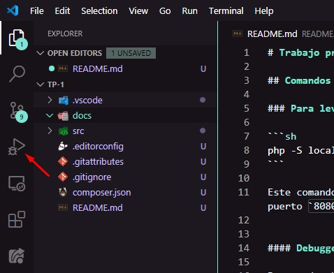
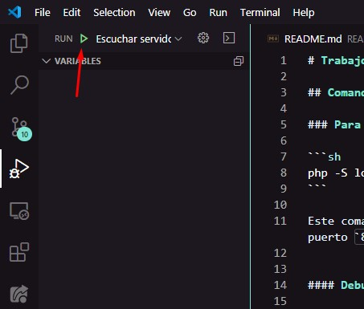
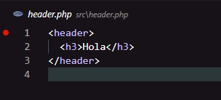

# Trabajo práctico 1: Repaso de conceptos

Como el servidor de desarrollo mapea 1 a 1 los archivos y carpetas, la URL inicial sería la siguiente: http://localhost:8080/src

## Comandos comunes para ejecutar

### Para levantar el servidor de PHP

```sh
php -S localhost:8080
```

Este comando le dice a PHP que levante un servidor (por eso el flag `-S` en la dirección `localhost` y puerto `8080`).

#### Debuggear servidor

Para poder empezar a debuggear, primero hay que asegurarse que el servidor PHP esté levantado en una una consola. Luego, basta con apretar F5; o ir al ícono con un bichito al lado del ícono de play:



Allí, dar clic en el ícono verde de play:



#### ¿Cómo pausar la ejecución de PHP?

Para poder debuggear una línea del código, se debe cliquear a la izquierda del número de la línea del código donde se quiera detener la aplicación, por ejemplo:



Al volver a ejecutar la operación que afecta a ese código, PHP pausará la ejecución en esa línea, permitiendo observar datos en ese instante.
